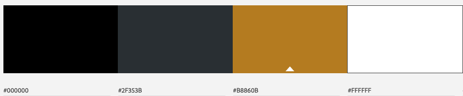

# **B-sharp - a professional Vocal Group**
### *Code Institute Milestone Project 1* 

This project is a frontend website for the fictitious vocal group “B-sharp”.  
The main focus for the website is to get people to buy tickets for their concerts and to book the group for events.  
 
The website provides information on upcoming concerts, on the group and its members and has some media samples. It also has the option buy tickets or to book the group for events.

A live version of this website can be viewed [here](https://chizzletaz.github.io/MilestoneProject1/)   
&nbsp;  

***

# **User Experience (UX)**

## **Strategic level**  
The target audience for this website is:
- People who want to buy tickets for the concerts
- Event planners who want to book the group 
- First time/occasional users looking for more information about the group

### **User stories:**	
**First time users:**

- As a first time user, I want to navigate easily across the website.
- As a first time user, I want to find information about the group and its members, so i can get to know the group better.
- As a first time user, I want to hear some of the recordings, to see whether I like the group’s music.

**Returning/regular users:**

- As a user, I want to follow the group, so I stay up to date with the latest news on what they do.
- As a user, I want to find information on concerts, so I can see when and where they are.
- As a user, I want to be able to buy tickets for their concerts.
- As a user, I want the option of buying a song or album.

**Event planners:**

- As an event planner, I want to learn more about the group and listen to some material, so I can decide whether or not to book the group for an event.
- As an event planner, I want to contact the group (by email or by phone), so I can get more information or book them for an event.

### **Owner goals:**

- As the owners we want users to buy tickets to our concerts.
- As the owners we want people to book us.
- As the owners we want to provide information on our group and its members, so first time visitors/event planners can get to know us.
- As the owners we want to provide media samples, so people can get to know us and/or buy our music.
- We want our social links displayed, so people can follow us and we can generate a fanbase.
- As the owners we want to give updates on what we’re doing, so we stay connected with our followers.  
&nbsp;  

## **Scope level**

Combining the user needs and owner goals gives the following requirements with their respective importance and viability/feasibility displayed in a trade-off equation:

|					| importance  | viability/feasibility
| --- | :---: | :---: |
|a. provide information about the group | 4	| 5
|b. provide information about concerts	| 5	| 5
|c. option to buy tickets online | 5 |3
|d. option to book the group	| 5	| 4	
|e. providing media samples		| 4	| 3
|f. social media promotion		| 3	| 4	
|g. provide contact information		| 5	| 5
|h. provide newsletter subscription	|4		|3
|i. option to buy a song or album	|3		|1

This means that the option to buy a song or album is not implemented now. This will be a feature left to implement. 
&nbsp;

## **Structure level**

Using Interaction Design and Information Design I made the following decisions:  

I want to keep the website consistent by keeping the same page structure along all pages. This enhances the user’s single-use-learning:

- I kept the header and footer the same on each page.
- I styled the button elements the same way.

I want the website to be easy to navigate:
- A responsive navigation bar at the top. 
- The logo at the top is also the link to the home page.
- On the homepage: besides the navigation-links in the navigation-bar, you can get to the other pages by clicking directly on the repective buttons for more information. E.g. at the 'about us'-section on the main page there is a button that leads to the page that has more information on the group and its members.

I want the information to be easily visible:
- I use visual aids like icons, matching colours and images.
- I've used a alternating backgroundcolors to indicate a new section on the page.
- I'm not giving too much information at once. 

I want the user to get feedback during their visit:
- The user get’s a visual feedback during certain actions (e.g. focussing on, clicking on, hovering over buttons and links).
- The user get's a feedback when an error as occured, like an image that can't be displayed.

I’ve based the content requirements on the most likely path a first time user or event planner would take (navigation flow). That is: get to know more about the group (*About Us*) and their music (*Our Music*) and then get tickets for a show or book the group.
Therefore the order in which the websites (and links) are presented is: 
**Home - About us - Our Music - Our Shows - Contact (dropdown menu with Book us)**  
Taking the owner goals into account as well, I’ve opted for the 'Book Us' and 'Upcoming Shows'-section to be displayed first on the main page to ‘seduce’ the first time user/event planner into wanting more information. 
&nbsp;  

## **Skeleton level**
As mentioned above, the website will have 5 pages:  
Home, About us, Our Music, Our Shows and Contact.

**Home**  
has a hero image with a CTA-button to book the group. Below that there is a short overview of all the other webpages with links to the respective pages (where more information can be found).  
**About Us**  
has a section about the group itself and a section about the members:  
**Our Music**  
has some audio- and video-links of music that the group has performed.  
**Our Shows**  
has information on the upcoming shows the group has.  
**Contact**  
has a a contact form for booking or inquiries. Below there is a section with general contact information.
 

**Wireframes:**

link to [wireframes](https://github.com/chizzletaz/MilestoneProject1/blob/master/assets/documents/Wireframes%20MSP1.pdf)  

## **Surface level**
**Colors**  
In order to get a calm, neat and stylish look, I've decided to keep the colours to black, grey and white with an accent-colour of #b8860b (an orange shade).   

**Fonts**  
For the logo I've chosen the 'Architects Daughter' typeface, because it is a handwritten typeface. This gives a more unique feeling to the logo.  
Also using text and font for the logo is an easier way to create the logo.

In order to keep the overall style and feeling of the site calm, I decided to mainly use one type of font: the Open Sans. This typeface is a sans-serif font and has an open feeling and is optimized for legibility across print, web, and mobile interfaces.  
To give some sort of variety to the text, I've use Open Sans Condensed for the headers.  

For the small text I've used 'Crimson text', a serif font.

# **Features**
functional specification:  
form for buying tickets  
form for booking the group  
email subscription button for newsletter
	
content requirements:  
personal info on the group and its members  
information on concerts and latest news  
embedded media content  
social media links  
contact details

**Existing Features:**  
On each site:  
Navigation bar:  
A navigation bar so users can easily navigate the website. On mobile screens it collapses into a ‘hamburger icon’ with dropdown menu to reduce taking up too much real estate.  
Footer:  
A footer with a Call To Action-button to subscribe to the newsletter of Be-Sharp. 
Also the social media links are present in the form of an icon.

Newsletter subscription:  
A button for a sign up-form at the bottom of the page allows the user to sign up to the email-newsletter of the group in order to stay up to date with the latest news about the group and upcoming concerts/projects. When clicked it opens up a modal.

social media profile links:  
displays icon links to the different social media profiles of the group.  
Desktop and tablet: On top of the page (navbar) and at the bottom of the page.  
Mobile: only on the bottom of the page.

**On individual pages** 
Home page

Booking page  
Booking tickets online: 
a form that lets users buy tickets on the website directly.
	
Media page  
Embedded audio/video links
Audio-files/videos are embedded on the site for users to listen to.

About page

Contact page  
Contact form - allows users to get in contact with the group for booking or information, by leaving their name and email address and the reason 

## **Features left to implement**
Future ideas  
Search bar  
option to buy a song or album  
A blog  
online payment

## **Technologies used**
*languages used*  
HTML, CSS  
*frameworks, libraries and programmes used*  
Bootstrap, Balsamiq, GitHub, GitPod

## **Testing** 

## **Deployment**

## **Credits**
### Code
change color of carousel-indicators:
https://stackoverflow.com/questions/46249541/change-arrow-colors-in-bootstraps-carousel (by Chris Gunawardena)

dark overlay for carousel:
https://www.codegrepper.com/code-examples/css/how+to+make+dark+overlay+css

size embedded video:
https://stackoverflow.com/questions/28124214/how-to-reduce-html-video-player-size-in-bootstrap (by ckuijjer)

### Content
### Media
**Images:**  

Microphone hero-image- Photo by Claus Grünstäudl on Unsplash  

Portrait1 - Photo by Taylor Deas-Melesh on Unsplash  
Portrait2 - Photo by Kreated Media on Unsplash  
Portrait3 - Photo by Payton Tuttle on Unsplash  
Portrait4 - Photo by Jurica Koletić on Unsplash   

christmas - Photo by Rodion Kutsaev on Unsplash  
firework - Photo by Erwan Hesry on Unsplash  
mozart - https://wallpaperaccess.com/mozart  

**Music and Video**  
All music files and video files are my property.

